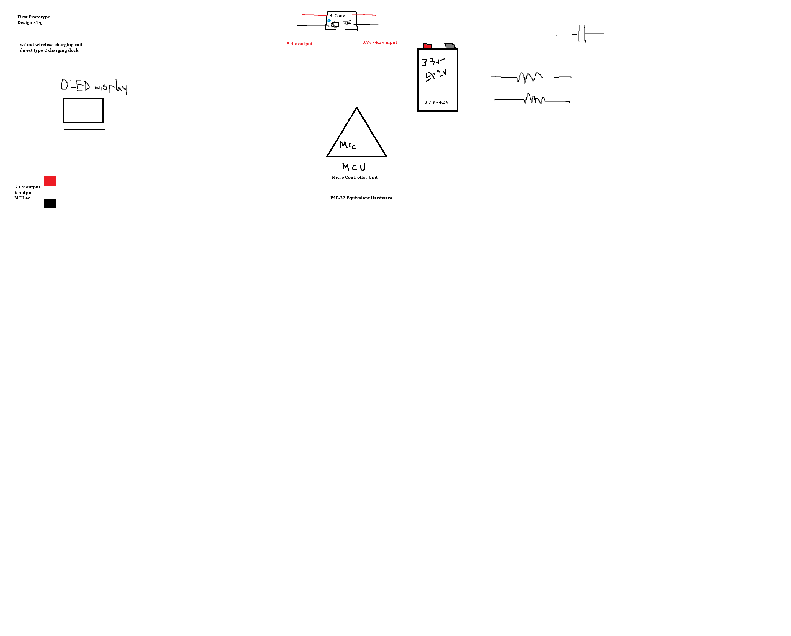
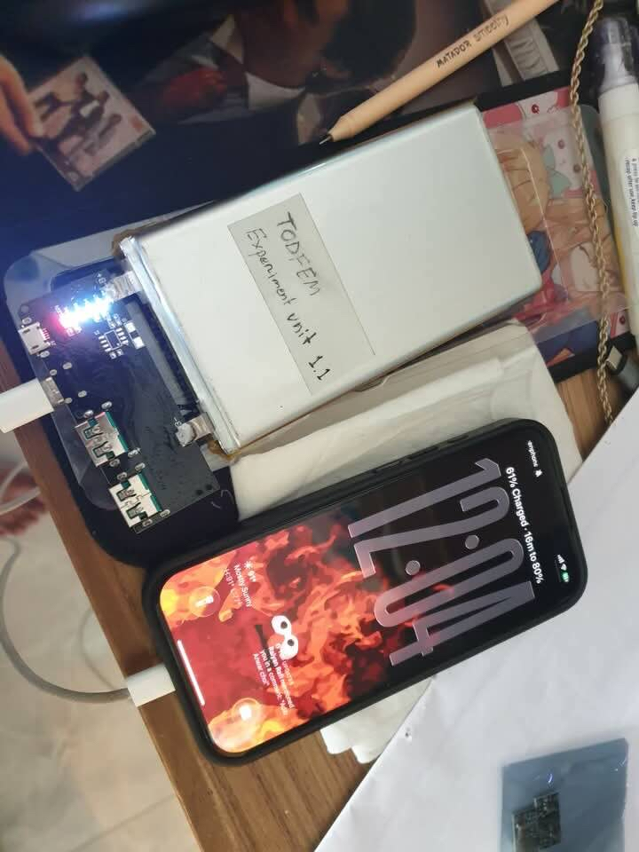
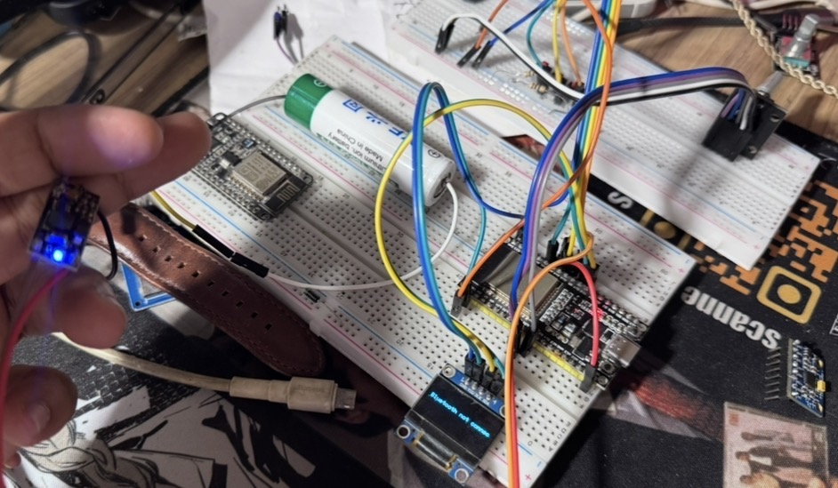

# VoltEdge-Delta-1
Smart Power Bank, with great power backup and Smart Features. Server system to manage power.


Description:
The following project is a part of TODFEM product. We are trying to achieve a revolutionary battery based product, through research and smart observations. We are hoping to launch a new product by the end of this year. If you want to donate or work on the following project please reach out @ 

email : anwaradib24@gmail.com  or visit https://linktr.ee/polauda

# Display System 

The following Device would show and display vital information about the powerbank, such as showing the battery parcent. 

# Wi-Fi based in depth information and much more
As an esp 32 would power this whole thing, this would be much more powerful mcu, so it can do a lot of things.

# Description of Project 
The project is based on this following research. The following document has all the requirements and safety feature description: https://docs.google.com/document/d/12Az-Lkp3-ZaH_W2DnesjL1Jfv3u9_doN4sM7y4v4LQA/edit?usp=sharing

# Battery Cell Choices
I took 18650 dimensions 4 batteries of 2600mAh. Also I am currently testing a 10,000mAh Li-Po Battery. If we head into slimmer solutions, we might get into lithium silicon batteries 😝 Cause WHY NOT !

# Battery Parcentage Dillema 🔋

# Feature from previous project 🔑🔐

IDK I am gonna add everything to it lolol 
I have decided to add BLE Keyboard functionality on my project

The following image is the working on breadboard codes for the project

# Sensor Lists // Hardware list 🦎

1. LDR ( Light Detecting Resistor )
2. Motion (accelerometer) Sensor ( x-y-z axis)
3. Buzzer
4. Temp sensor (Thermo-resistor)
5. Speaker
6. Led Indicators
7. NFC (Tag or chip) Probably also a reader Phone pairing with this ! ( NOT CONFIRMED ) ???????
8. Battery Bank ( with Fast charging supported )
9. Wi-Fi / BLE Bluetooth supported
10. Display Module Oled Display
11. 12v output for some reason idk
